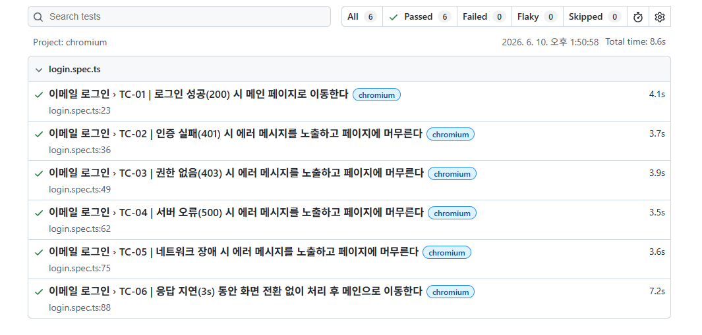

# Seomse Web · 로그인 기능 QA 자동화 (Playwright)

Playwright + TypeScript 기반으로 **이메일 로그인 기능**의 E2E QA 자동화 테스트를 구축한 프로젝트입니다.

---

## 1. 프로젝트 소개

Seomse(헤어 예약 서비스) 웹 프론트엔드의 로그인 기능에 대해, Playwright를 활용한 QA 자동화 테스트를 구축했습니다.
실제 사용자 관점에서 **로그인 성공/실패, 서버 오류, 네트워크 장애, 응답 지연** 등 다양한 상황에서 프론트엔드가 올바르게 동작하는지를 자동으로 검증합니다.

- 대상 서비스: React 19 + Vite SPA (TanStack Query, react-router-dom v7)
- 검증 대상 컴포넌트: `src/components/login/EmailLoginSection.tsx` (라우트 `/email-login`)
- 호출 API: `POST https://api.seomse.kro.kr/user/auth/login`

---

## 2. 테스트 전략

> 현재 백엔드 API 서버가 중단된 상태이므로, 실제 API를 호출하는 E2E 테스트 대신 **Playwright의 Network Mocking(`page.route`)** 을 활용했습니다.
> 로그인 API 응답을 Mock 처리하여, **프론트엔드가 다양한 장애 상황에서 올바르게 동작하는지** 검증했습니다.

### 왜 Network Mocking인가?

| 항목 | 설명 |
| --- | --- |
| **백엔드 비의존성** | API 서버가 없어도 프론트엔드 단독으로 테스트 가능 |
| **장애 상황 재현** | 실제로 만들기 어려운 401/403/500/네트워크 단절/지연을 결정적(deterministic)으로 재현 |
| **빠르고 안정적** | 외부 네트워크에 의존하지 않아 빠르고 flaky하지 않음 |
| **실 코드 기반** | 가상의 URL/셀렉터 없이, 실제 호출 경로(`/user/auth/login`)와 실제 DOM(label/role)만 사용 |

### 동작 방식

```
[Playwright] npm run dev 로 프론트엔드만 기동
      │
      ├─ page.route("**/user/auth/login")  ← 로그인 API 요청을 가로챔
      │       └─ 시나리오별 Mock 응답 반환 (200 / 401 / 403 / 500 / abort / delay)
      │
      └─ Page Object(LoginPage)로 폼 입력 → 제출 → 결과 검증
```

---

## 3. 검증 시나리오

| 시나리오 | Mock 처리 | 검증 내용 |
| --- | --- | --- |
| 로그인 성공 | `200 OK` + `{ data: { accessToken } }` | 메인 페이지(`/`)로 이동 |
| 인증 실패 | `401 Unauthorized` | 에러 alert 노출 + 페이지 유지 |
| 권한 없음 | `403 Forbidden` | 에러 alert 노출 + 페이지 유지 |
| 서버 오류 | `500 Internal Server Error` | 에러 alert 노출 + 페이지 유지 |
| 네트워크 장애 | `route.abort("failed")` | 에러 alert 노출 + 페이지 유지 |
| 응답 지연 | `3s delay` 후 `200 OK` | 지연 중 화면 전환 없음 → 응답 후 메인 이동 |

> 상세 테스트 케이스는 [`TEST_CASES.md`](./TEST_CASES.md) 참고

---

## 4. 테스트 실행 결과

백엔드 API 서버가 중단된 환경에서, **Playwright Network Mocking으로 로그인 API 응답을 가로채** 6개 시나리오를 모두 자동 검증했습니다. 전 케이스가 통과했으며, 외부 네트워크에 의존하지 않아 매 실행마다 동일한 결과를 보장합니다.

| 항목 | 결과 |
| --- | --- |
| 총 테스트 | **6** |
| ✅ Passed | **6** |
| ❌ Failed | **0** |
| 테스트 파일 | `login.spec.ts` |
| 브라우저 | Chromium |
| 총 실행 시간 | 약 8.6s |



### 검증한 테스트 케이스

| ID | 테스트 케이스 | Mock 응답 | 결과 |
| --- | --- | --- | --- |
| TC-01 | 로그인 성공 시 메인 페이지로 이동 | `200 OK` | ✅ Pass |
| TC-02 | 인증 실패 시 에러 메시지 노출 | `401 Unauthorized` | ✅ Pass |
| TC-03 | 권한 없음 시 에러 메시지 노출 | `403 Forbidden` | ✅ Pass |
| TC-04 | 서버 오류 시 에러 메시지 노출 | `500 Internal Server Error` | ✅ Pass |
| TC-05 | 네트워크 장애 시 에러 메시지 노출 | `route.abort("failed")` | ✅ Pass |
| TC-06 | 응답 지연(3s) 후 정상 처리 | `3s delay → 200 OK` | ✅ Pass |

### 이 결과가 의미하는 것 (QA 관점)

- **실 서버 없이도 품질 검증이 가능함을 입증** — API 서버가 내려간 상황에서도 Network Mocking으로 로그인 플로우의 정상/예외 동작을 모두 재현해 검증했습니다. 백엔드 가용성과 무관하게 프론트엔드 회귀 테스트를 돌릴 수 있는 체계를 갖춘 셈입니다.
- **해피 패스가 아닌 예외 흐름까지 커버** — 6개 중 4개가 인증 실패·권한 없음·서버 오류·네트워크 장애 등 **장애 상황**입니다. 실제 운영에서 사용자가 마주치는 비정상 시나리오를 의도적으로 재현해, 프론트엔드가 항상 사용자에게 안내를 제공하고 보호되지 않은 화면으로 넘어가지 않음을 확인했습니다.
- **결정적(deterministic)이고 빠른 테스트** — 실제 네트워크에 의존하지 않아 8.6초 만에 완료되며 flaky하지 않습니다. CI 파이프라인에 그대로 편입할 수 있습니다.
- **테스트가 명세-구현 괴리를 드러냄** — 자동화 과정에서 "401·403·500이 동일한 문구로 표시"되고 "로딩 UI가 없는" 결함을 발견했습니다. (아래 [§9 개선 포인트](#9-테스트를-통해-발견된-개선-포인트-qa-관점)) 단순 통과/실패가 아니라 개선 지점을 짚는 데까지 활용했습니다.

---

## 5. 기술 스택

- **Playwright** (`@playwright/test`)
- **TypeScript**
- **E2E Testing**
- **Network Mocking** (`page.route` / `route.fulfill` / `route.abort`)
- **Page Object Model (POM)**

---

## 6. 폴더 구조

```
e2e/
├── pages/            # Page Object Model
│   └── LoginPage.ts          # 로그인 페이지 셀렉터 + 액션
├── mocks/            # API Mock 핸들러
│   └── auth.mock.ts          # 로그인 API 시나리오별 응답
├── fixtures/         # 테스트 fixture / 데이터
│   ├── test.ts               # loginPage·dialog 커스텀 fixture
│   └── loginData.ts          # 입력 데이터 / 기대 문구 상수
├── specs/            # 테스트 코드
│   └── login.spec.ts         # 6개 시나리오 테스트
├── utils/            # 공용 유틸
│   └── dialog.ts             # window.alert 메시지 수집기
├── tsconfig.json
├── README.md
└── TEST_CASES.md

playwright.config.ts          # (프로젝트 루트) 설정 + webServer
```

---

## 7. 실행 방법

### 최초 1회: 설치

```bash
# 의존성 설치 (@playwright/test 포함)
npm install

# Playwright 브라우저 바이너리 설치
npx playwright install
```

### 테스트 실행

```bash
# 전체 테스트 실행 (dev server 자동 기동)
npm run test:e2e
# 또는
npx playwright test

# UI 모드 (디버깅에 유용)
npm run test:e2e:ui

# 브라우저를 띄운 채 실행
npm run test:e2e:headed

# HTML 리포트 확인
npm run test:e2e:report
```

> `playwright.config.ts`의 `webServer` 설정이 `npm run dev`를 자동 실행하므로, 별도로 프론트엔드를 띄울 필요가 없습니다. (이미 떠 있으면 재사용)

---

## 8. 구현 포인트 (코드 규칙)

- **getByRole / getByLabel 우선**: CSS 클래스 하드코딩 대신 접근성 기반 셀렉터 사용
  - 아이디/비밀번호: `getByLabel("아이디" / "비밀번호", { exact: true })`
    (`InputForm`의 `<label htmlFor>` ↔ `<input id>` 연결 구조 활용)
  - 제출 버튼: `getByRole("button", { name: "로그인" })`
- **Page Object Model**: 셀렉터/액션을 `LoginPage`에 캡슐화 → 유지보수성 확보
- **Mock 모듈 분리**: 시나리오별 Mock 함수를 `auth.mock.ts`로 분리해 재사용
- **alert 검증**: 에러가 DOM이 아닌 `window.alert`로 노출되므로 `DialogRecorder`로 dialog 이벤트를 수집해 검증
- **실 코드 기반**: API 경로/요청 바디/응답 구조/문구를 모두 실제 소스코드에서 추출

---

## 9. 테스트를 통해 발견된 개선 포인트 (QA 관점)

자동화 과정에서 발견한, 실제 사용자 경험을 해치는 지점들입니다. (포트폴리오/면접 어필 포인트)

1. **에러 상황 미구분**
   `usePostApi`가 4xx/5xx/네트워크 오류를 동일하게 throw하고, `onError`는 status를 구분하지 않아
   **401·403·500·네트워크 장애가 전부 같은 문구**(`"아이디 또는 비밀번호를 확인해주세요."`)로 표시됩니다.
   → 서버 오류(500)인데 "비밀번호를 확인하라"고 안내해 사용자에게 혼란을 줍니다.
   - 제안: status별 메시지 분기 (인증 실패 / 권한 없음 / 일시적 서버 오류 / 네트워크 확인).

2. **로딩 상태 UI 부재**
   훅은 `isPending`을 반환하지만 `EmailLoginSection`에서 사용하지 않아,
   **응답이 지연되는 동안 어떤 피드백도 없습니다.** (TC-06에서 확인)
   → 사용자가 버튼을 중복 클릭하거나 멈춘 것으로 오인할 수 있습니다.
   - 제안: `isPending` 동안 버튼 비활성화 + 스피너 노출.

3. **에러 노출 수단**
   에러를 `alert()`로 처리해 브라우저 네이티브 모달에 의존합니다.
   → 인라인 에러 메시지(폼 하단)로 전환하면 접근성/일관성이 향상됩니다.
